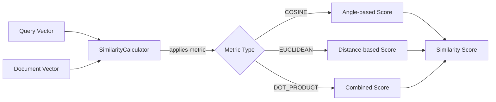
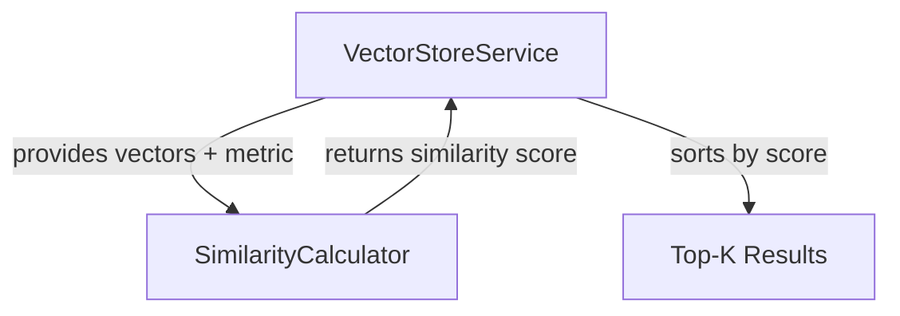

# Similarity Calculator: The Mathematics of Meaning

Imagine you have two people described by their hobbies: Person A likes [reading, hiking, cooking] and Person B likes [books, walking, baking]. How similar are they? The **SimilarityCalculator** answers exactly this question for high-dimensional vectors. It measures how "close" two embeddings are in 384-dimensional space, turning geometric distance into semantic similarity.

## What is SimilarityCalculator?

The **SimilarityCalculator** is a component that implements three mathematical distance/similarity metrics to compare vectors. Given two embeddings (represented as float arrays), it calculates a numerical score indicating how semantically similar the original texts are.

This is the "physics" in "the physics of AI"—the actual mathematics that powers semantic search.

## How It Works

The calculator provides three distinct metrics, each with different mathematical properties and use cases:

1. **Cosine Similarity**: Measures the angle between vectors (ignores magnitude)
2. **Euclidean Distance**: Measures straight-line distance in vector space
3. **Dot Product**: Combines both angle and magnitude

### Key Responsibilities

- **Calculate cosine similarity** between two vectors (most common for embeddings)
- **Calculate euclidean distance** for geometric distance measurements
- **Calculate dot product** for combined similarity/magnitude scoring
- **Validate dimensions** to ensure vectors are comparable
- **Normalize scores** to unified "higher = more similar" convention
- **Handle edge cases** like zero vectors

### Data Flow

Query and document vectors flow through the calculator, which applies the chosen metric and returns a numerical similarity score.



## Vectors, Dimensions, and Magnitude: A Geometric Primer

Before we look at how each metric works, two pieces of vocabulary that come up over and over in this chapter: **dimension** and **magnitude**.

### Dimension: the number of axes in the space

A "dimension" is just an independent axis you can measure along.

- A 2-dimensional vector is a point on a plane: `[x, y]`. You can plot it on graph paper.
- A 3-dimensional vector is a point in space: `[x, y, z]`. Picture a room.
- A 384-dimensional vector (what `AllMiniLM-L6-v2` produces) is the same idea, just with 384 axes you can't draw. Each axis is an abstract feature the embedding model learned during training. Maybe one axis tracks "is this about food?", another tracks "is this formal language?", another encodes "is this a question?" We don't know which, and we don't need to. The model picked these axes by itself, and a single chunk of text becomes a list of 384 numbers ("how much of each feature does this text have").

When the code says `vectorA.length != vectorB.length`, it's asking "are these two vectors describing points in the same space?" Comparing a 384-dim vector to a 512-dim vector is like comparing a point on graph paper to a point inside a room: there's no meaningful "distance" between them, because they don't share a coordinate system. That's why `validateDimensions(...)` exists.

### Magnitude: how long the vector is

Magnitude is the length of the arrow from the origin `(0, 0, …, 0)` to the vector's coordinates. Mathematically: `‖v‖ = √(v₁² + v₂² + … + vₙ²)`.

- A vector `[3, 4]` has magnitude `√(9+16) = 5`.
- A vector `[0.6, 0.8]` has magnitude `√(0.36+0.64) = 1`. Same direction, different length.

For text embeddings, the magnitude often reflects something like *intensity* or *quantity*: longer/more emphatic text can produce longer vectors. Two vectors can **point the same way** (high directional similarity) but have **very different magnitudes** (e.g. "good" vs "very, very, very good"). The metric you pick decides whether that magnitude difference matters or not.

A vector is called a **unit vector** when its magnitude is exactly 1. Many embedding models (including `AllMiniLM-L6-v2`) normalise their output to unit vectors, which has consequences we'll come back to below.

## Picking a Metric: Cosine vs Euclidean vs Dot Product

The three metrics measure different things. Quick comparison, then prose:

| Metric         | What it measures              | Range            | Magnitude-sensitive? | Higher = more similar?    | Cost          |
|----------------|-------------------------------|------------------|----------------------|---------------------------|---------------|
| **Cosine**     | Angle between the vectors     | −1 … 1           | No                   | Yes                       | Two sums + √  |
| **Euclidean**  | Straight-line distance        | 0 … ∞            | Yes                  | No (closer = more similar)| One sum + √   |
| **Dot product**| Angle × both magnitudes       | −∞ … ∞ (unbounded) | Yes                | Yes (if magnitudes ≥ 0)   | One sum, no √ |

### Cosine similarity: "do these two arrows point the same way?"

Cosine ignores the lengths of the vectors and asks only about the **angle** between them. Two vectors pointing in exactly the same direction score 1.0 regardless of length; vectors perpendicular to each other score 0.0; opposite vectors score −1.0.

This is what you want for **semantic search over text**. The reason: an embedding model might produce a longer vector for "the cat sat on the mat" than for "cat" (same topic, different emphasis). Cosine treats those as highly similar (which they are, semantically); euclidean would penalise the length difference.

> **Use cosine when:** you're comparing the *meaning* of two pieces of text and don't care that one is longer or more emphatic than the other. This is the default for RAG.

### Euclidean distance: "how far apart are these two points?"

Euclidean is the classic Pythagorean distance, extended to N dimensions. It's sensitive to both direction *and* magnitude. Two vectors that point the same way but differ in length will still have a non-zero euclidean distance.

This is useful when **magnitude carries signal**: comparing image embeddings where brightness matters, or sentiment vectors where the *intensity* of "very angry" vs "slightly annoyed" should pull them apart even if both are negative-sentiment.

> **Use euclidean when:** your embeddings encode magnitude-carrying signal (image intensity, sentiment strength, document length) and you want vectors that "agree but louder" to count as less similar.

Note the code's `-euclideanDistance(...)` negation in the unified `score()` method below: distance gets smaller as things get closer, but the workshop sorts results "highest score first," so the score path flips the sign to keep one consistent convention across all three metrics.

### Dot product: "angle and magnitudes combined into one number"

Dot product is the un-normalised version of cosine: `cosine = dotProduct / (magnitudeA × magnitudeB)`. Take cosine and stop before dividing by the magnitudes; that's dot product. So it cares about both the angle *and* how long each vector is. Two unit vectors that point the same way score 1 (same as cosine); a long vector that points the same way scores higher than a short one.

It's also the cheapest of the three: no square root, no division. Some vector databases use it as the default for that reason.

> **Use dot product when:** (a) your embeddings are already normalised to unit vectors (in which case dot product *equals* cosine but is faster), or (b) you genuinely want a metric that combines direction and magnitude into a single score and rewards "louder" vectors.

### The "are they normalised?" question

Here's the subtlety that catches people: when both vectors are unit vectors (magnitude 1), **cosine and dot product give the same answer**. The division step in cosine (`/ (‖A‖ × ‖B‖)`) becomes `/ 1`, which is a no-op.

So with `AllMiniLM-L6-v2` (which normalises its output) you get:

- **Cosine == dot product** at the level of score values. Pick dot product for the perf win.
- **Euclidean distance == `√(2 − 2 × cosine)`**, a tidy identity that's *only* true for unit vectors. It lets you convert between the two without recomputing. If you ever swap in an embedding model that doesn't normalise, this identity breaks.

For the workshop's defaults, treat cosine as the right pick and don't worry about the distinction.

### Decision tree

```
Are the vectors normalised (unit length)?
├── Yes
│   ├── Want speed? ──────────────→ Dot product
│   └── Want clarity / standard? ─→ Cosine (functionally identical)
└── No
    ├── Care only about meaning / direction? ─→ Cosine
    ├── Magnitude carries signal? ────────────→ Euclidean
    └── Want a single combined score? ────────→ Dot product
```

## Code Deep Dive

Let's explore each similarity metric in detail.

### Cosine Similarity

The most widely used metric for text embeddings:

```java
public double cosineSimilarity(float[] vectorA, float[] vectorB) {
    validateDimensions(vectorA, vectorB);

    double dotProduct = 0.0;
    double normA = 0.0;
    double normB = 0.0;

    for (int i = 0; i < vectorA.length; i++) {
        dotProduct += vectorA[i] * vectorB[i];
        normA += vectorA[i] * vectorA[i];
        normB += vectorB[i] * vectorB[i];
    }

    if (normA == 0.0 || normB == 0.0) {
        return 0.0;
    }

    return dotProduct / Math.sqrt(normA * normB);
}
```

**Breakdown**:
- **`dotProduct`**: Sum of element-wise multiplication (Σ a_i × b_i)
- **`normA` and `normB`**: Squared magnitudes of each vector (Σ a_i²)
- **`Math.sqrt(normA * normB)`**: Product of vector magnitudes
- **Result**: A value between -1 (opposite) and 1 (identical), where 0 means orthogonal (unrelated)

**Why cosine?** It measures angle, not distance. Two vectors can be far apart in space but still point in the same direction (high similarity). This is perfect for text where "cat" and "cats" should be very similar despite slightly different embeddings.

**Mathematical formula**: `cosine(A, B) = (A · B) / (||A|| × ||B||)`

### Euclidean Distance

The straight-line distance in vector space:

```java
public double euclideanDistance(float[] vectorA, float[] vectorB) {
    validateDimensions(vectorA, vectorB);

    double sum = 0.0;
    for (int i = 0; i < vectorA.length; i++) {
        double difference = vectorA[i] - vectorB[i];
        sum += difference * difference;
    }
    return Math.sqrt(sum);
}
```

**Breakdown**:
- **`difference`**: Subtract corresponding elements (a_i - b_i)
- **`sum`**: Accumulate squared differences (Σ (a_i - b_i)²)
- **`Math.sqrt(sum)`**: Take square root to get distance
- **Result**: A value from 0 (identical) to infinity (very different)

**Why euclidean?** It measures actual geometric distance. Useful when magnitude matters (e.g., comparing document lengths, intensity of sentiment).

**Mathematical formula**: `euclidean(A, B) = √(Σ (a_i - b_i)²)`

### Dot Product

The raw similarity without normalization:

```java
public double dotProduct(float[] vectorA, float[] vectorB) {
    validateDimensions(vectorA, vectorB);

    double sum = 0.0;
    for (int i = 0; i < vectorA.length; i++) {
        sum += vectorA[i] * vectorB[i];
    }
    return sum;
}
```

**Breakdown**:
- **`sum`**: Accumulate element-wise products (Σ a_i × b_i)
- **Result**: An unbounded value that combines angle and magnitude
- **Interpretation**: Higher values mean more similar and/or larger magnitude vectors

**Why dot product?** It's computationally cheaper (no square root) and useful when both direction and magnitude matter. Some embedding models are trained to be "normalized" (unit vectors), making dot product equivalent to cosine similarity but faster.

**Mathematical formula**: `dot(A, B) = Σ a_i × b_i`

### Unified Scoring Interface

The `score()` method provides a consistent interface across all metrics:

```java
public double score(float[] vectorA, float[] vectorB, SearchMetric metric) {
    return switch (metric) {
        case COSINE -> cosineSimilarity(vectorA, vectorB);
        case EUCLIDEAN -> -euclideanDistance(vectorA, vectorB);
        case DOT_PRODUCT -> dotProduct(vectorA, vectorB);
    };
}
```

**Breakdown**:
- **Switch expression**: Routes to the appropriate metric
- **`-euclideanDistance`**: Negates distance so "higher = more similar" (consistent convention)
- **Return**: A score where higher values always mean more similar

**Why negate euclidean?** Euclidean distance decreases as similarity increases (0 = identical), but we want higher scores for better matches. Negating makes all metrics consistent for sorting.

### Dimension Validation

Safety check to prevent mismatched vectors:

```java
private void validateDimensions(float[] vectorA, float[] vectorB) {
    if (vectorA.length != vectorB.length) {
        throw new IllegalArgumentException("Vectors must have the same dimensions");
    }
}
```

**Why validate?** Comparing a 384-dim vector to a 512-dim vector is mathematically invalid and would throw `ArrayIndexOutOfBoundsException` or produce garbage results.

## Relationships to Other Components

The SimilarityCalculator is used by the VectorStoreService during search:



**Detailed Relationships**:

1. **VectorStoreService → SimilarityCalculator**: During search, the vector store calls `score(queryVector, documentVector, metric)` for every indexed segment to calculate relevance. For 18 indexed segments and 1 query, that's 18 score calculations per search.

2. **SimilarityCalculator → VectorStoreService**: Returns a double score that the vector store uses to rank segments. Higher scores appear first in search results.

The calculator is **pure computation**—no state, no I/O, just math. This makes it extremely testable and performant.

## Key Takeaways

- **Cosine similarity** is best for text embeddings (direction > magnitude)
- **Euclidean distance** works when geometric distance matters
- **Dot product** is fastest but sensitive to vector magnitude
- **All metrics operate on float arrays** representing high-dimensional vectors
- **The choice of metric** can significantly impact search results
- **Dimension validation** prevents subtle bugs from mismatched embeddings
- **Unified scoring** (higher = better) simplifies ranking logic

## Practice Exercise

Now it's your turn! Apply what you've learned with this hands-on exercise:

1. **Create a test to compare metrics**:
   ```java
   @Test
   void compareMetrics() {
       float[] vec1 = {1.0f, 0.0f, 0.0f};  // Unit vector on X axis
       float[] vec2 = {0.707f, 0.707f, 0.0f};  // 45° angle from vec1
       float[] vec3 = {0.0f, 1.0f, 0.0f};  // Orthogonal to vec1

       double cosine12 = calculator.cosineSimilarity(vec1, vec2);
       double cosine13 = calculator.cosineSimilarity(vec1, vec3);

       double euclidean12 = calculator.euclideanDistance(vec1, vec2);
       double euclidean13 = calculator.euclideanDistance(vec1, vec3);

       // What do you expect? Print results and verify your intuition.
   }
   ```

2. **Test with real embeddings**:
   ```java
   float[] catEmbedding = embeddingService.getVector("cat");
   float[] dogEmbedding = embeddingService.getVector("dog");
   float[] carEmbedding = embeddingService.getVector("car");

   double catDog = calculator.cosineSimilarity(catEmbedding, dogEmbedding);
   double catCar = calculator.cosineSimilarity(catEmbedding, carEmbedding);

   // Pets should be more similar than pet-to-vehicle
   assertThat(catDog).isGreaterThan(catCar);
   ```

3. **Bonus**: Implement **Manhattan distance** (L1 norm): `Σ |a_i - b_i|`

4. **Challenge**: Modify the `score()` method to normalize euclidean scores to [0, 1] range using: `score = 1 / (1 + distance)`

**Expected Outcome**: In the angle test, vec1 and vec2 should have cosine similarity ~0.707 (cos(45°)), while vec1 and vec3 should be 0 (orthogonal). The cat-dog similarity should be higher than cat-car, demonstrating that embeddings capture semantic relationships.

**Hints**:
- Cosine similarity of orthogonal vectors is always 0
- Euclidean distance between unit vectors depends on angle: `distance = √(2 - 2×cosine)` — note this identity **only** holds when both vectors are unit-length (‖v‖ = 1). AllMiniLM-L6-v2 returns normalized embeddings, so it applies here; if you ever swap in a model that doesn't normalize, divide each vector by its L2 norm first or this shortcut produces wrong distances.
- Real embeddings are 384-dim, but the math is the same as 3-dim
- Use `assertThat(value).isCloseTo(expected, within(0.01))` for floating-point comparisons

**Solution**: The key insight is understanding when each metric shines. Cosine similarity is invariant to vector magnitude (scaling doesn't change angle), making it robust for text where "important concept" and "very important concept" should be similar. Euclidean distance treats magnitude as signal, useful for comparing densities or quantities. Dot product is the raw correlation, fastest to compute but assumes normalized vectors. For semantic search, cosine similarity is almost always the right choice.

---

## Navigation

👈 **[Previous: Document Chunker: Breaking Text into Digestible Pieces](03-document-chunker.md)**

👉 **[Next: Vector Store Service: The Orchestration Engine](05-vector-store-service.md)**
