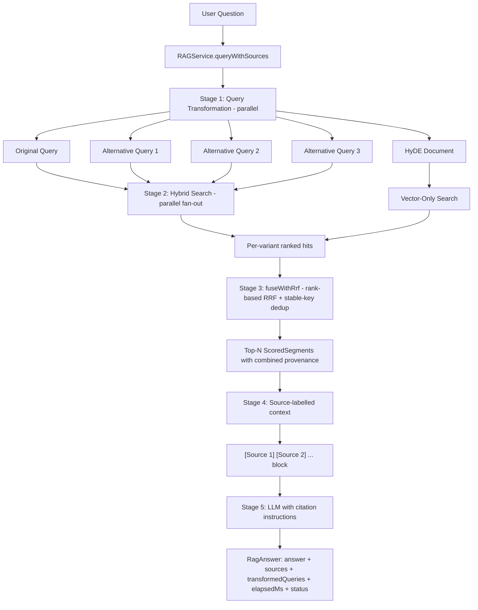

# RAG Service: The Complete Pipeline

You've learned about query transformation, hybrid search, and re-ranking as isolated components. Now it's time to see how they **orchestrate together** in a production RAG pipeline. The `RAGService` is the conductor of this symphony, coordinating five stages: parallel query transformation → parallel multi-path retrieval → rank-based RRF + dedup → source-labelled context assembly → grounded answer generation. This chapter explores how those pieces fit together to produce grounded answers along with the citations, query trace, and status code a real consumer needs.

## What is RAGService?

**RAGService** is the orchestration layer that implements the complete Retrieval-Augmented Generation pipeline. It:

1. **Transforms** the user's question into multiple query variants and a hypothetical answer document
2. **Retrieves** relevant segments by fanning out across all variants in parallel
3. **Fuses** results using rank-based Reciprocal Rank Fusion with stable-key deduplication
4. **Assembles** a source-labelled context block from the top-ranked segments
5. **Generates** a grounded answer that cites those sources inline

The public entry point is `queryWithSources(question, useQueryExpansion)`, which returns a `RagAnswer` carrying the answer text, the ordered `Source` list a UI can render, the transformed-query trace, the elapsed wall-clock time, and a `RagStatus` that tells callers whether the answer is grounded or the pipeline degraded.

## The Five-Stage RAG Pipeline

Let's visualize the complete flow:



### Stage 1: Query Transformation (parallel)

**Goal:** Generate alternative perspectives and a hypothetical answer document for the question.

**Actions:**
- Generate 3 alternative phrasings using multi-query expansion
- Generate a hypothetical answer document using HyDE
- Run both LLM calls concurrently inside a `StructuredTaskScope` with a 20-second total budget
- On timeout or interrupt, degrade gracefully to "no expansion"

**Output:** Up to 3 alternative queries plus an optional HyDE document.

### Stage 2: Multi-Path Retrieval (parallel)

**Goal:** Retrieve candidate segments from all query perspectives in parallel.

**Actions:**
- Fork one hybrid search subtask per query variant (original + alternatives)
- Fork one vector-only search subtask for the HyDE document (when present)
- Join the scope under a 5-second budget; on timeout, mark the pipeline `CANCELLED`
- Collect each subtask's hits into a `VariantHits(sourceQuery, retriever, weight, hits)` record so rank position is preserved

**Output:** A list of `VariantHits`, typically 4–5 shards × 5 hits = 20–25 candidates.

### Stage 3: Rank-Based RRF + Dedup

**Goal:** Combine the per-shard rankings into a single global ranking that doesn't care about raw retriever score scales.

**Actions:**
- For each hit in each shard, compute `contribution = weight × 1 / (RRF_K + rank)`, where `rank` is the 1-indexed position inside that shard
- Sum contributions per `stableKey(segment)` (structural ID when available, normalized text otherwise)
- Combine the per-shard provenance into a `retriever: query | retriever: query | ...` string so the UI can show every shard that found a chunk
- Sort by summed RRF score descending and keep the top `MAX_CONTEXT_SEGMENTS` (default: 10)

**Output:** Up to 10 unique `ScoredSegment` objects, each carrying its fused RRF score and combined provenance.

### Stage 4: Source-Labelled Context Assembly

**Goal:** Format the ranked segments into a context block the LLM can cite from.

**Actions:**
- Emit one `[Source N] title=... chunk=...` header per segment
- Follow each header with the segment text
- Build a parallel `List<Source>` so that `[Source 3]` in the answer maps to `sources.get(2)` for the consumer

**Output:** A formatted context string plus a structured `List<Source>` ready to be returned.

### Stage 5: Grounded Answer Generation

**Goal:** Generate an answer that cites the labelled sources inline.

**Actions:**
- Build a prompt that names the assistant, instructs it to answer strictly from the context, and tells it to cite sources using the `[Source N]` markers from the context block
- Call the LLM
- If the call throws, return `RagStatus.GENERATION_FAILED` with the sources still populated (so a UI can show "I couldn't generate text, but here are the chunks I found")

**Output:** A `RagAnswer` with `status = ANSWERED` on the happy path, or one of the four degraded statuses otherwise.

## Code Deep Dive

Let's explore the `RAGService` implementation in detail.

### Core Service Class

```java
@Service
public class RAGService {

    private static final Logger log = LoggerFactory.getLogger(RAGService.class);
    private static final int DEFAULT_TOP_K = 5;
    private static final int MAX_CONTEXT_SEGMENTS = 10;
    private static final int RRF_K = 60;
    private static final double WEIGHT_ORIGINAL = 1.25;
    private static final double WEIGHT_EXPANDED = 1.0;
    private static final double WEIGHT_HYDE = 0.75;
    private static final Duration STEP1_TIMEOUT = Duration.ofSeconds(20);
    private static final Duration STEP2_TIMEOUT = Duration.ofSeconds(5);

    private final HybridSearchService searchService;
    private final ChatModel llm;
    private final QueryTransformer queryTransformer;

    public RAGService(HybridSearchService searchService, ChatModel llm, QueryTransformer queryTransformer) {
        this.searchService = searchService;
        this.llm = llm;
        this.queryTransformer = queryTransformer;
    }

    public RagAnswer queryWithSources(String userQuestion, boolean useQueryExpansion) {
        // ... pipeline stages ...
    }
}
```

**Design decisions:**
- **Three dependencies**: `HybridSearchService`, `ChatModel`, `QueryTransformer`
- **One public method**: `queryWithSources(question, useQueryExpansion)` returns the rich `RagAnswer`; the older `String`-only API has been removed because it left callers with no way to resolve `[Source N]` markers
- **Per-source weights**: the user's actual phrasing is the strongest signal (`1.25`); LLM-generated alternatives are the baseline (`1.0`); HyDE is discounted (`0.75`) because its embedding came from invented text
- **Scope timeouts**: a stuck LLM call or a stalled search can't hang the HTTP request — both scopes have explicit budgets
- **Structured logging**: box-drawing characters create visual hierarchy in logs so the trace stays readable even with parallel subtasks

### Stage 1: Query Transformation (parallel)

```java
try (var scope = StructuredTaskScope.open(
        Joiner.awaitAllSuccessfulOrThrow(),
        config -> config.withTimeout(STEP1_TIMEOUT))) {

    Subtask<List<String>> multiQueryTask = scope.fork(() -> safeMultiQuery(userQuestion));
    Subtask<String> hydeTask = scope.fork(() -> safeHyde(userQuestion));
    scope.join();

    alts = sanitizeAlternatives(multiQueryTask.get(), userQuestion);
    hyde = hydeTask.get();
} catch (StructuredTaskScope.TimeoutException e) {
    log.warn("Query transformation timed out; degrading to original-query-only", e);
}
```

**Key points:**
- **Two LLM calls run concurrently**: multi-query and HyDE are independent, so they go through the same scope
- **`safeMultiQuery` / `safeHyde` swallow recoverable errors**: a single LLM hiccup degrades that branch rather than failing the whole pipeline
- **Sanitisation**: `sanitizeAlternatives` drops blanks, trims whitespace, dedupes case-insensitively, removes exact case-insensitive echoes of the original, and caps at 4 — belt-and-braces around the LLM contract
- **Time budget**: 20 seconds covers two LLM calls in parallel with headroom; on timeout we fall back to the original query alone

### Stage 2: Multi-Path Retrieval (parallel)

```java
try (var scope = StructuredTaskScope.open(
        Joiner.<List<ScoredSegment>>awaitAllSuccessfulOrThrow(),
        config -> config.withTimeout(STEP2_TIMEOUT))) {

    Subtask<List<ScoredSegment>> originalTask =
            scope.fork(() -> safeHybridSearch(userQuestion, DEFAULT_TOP_K));

    List<AltSubtask> altTasks = new ArrayList<>();
    for (String alt : alternatives) {
        altTasks.add(new AltSubtask(alt,
                scope.fork(() -> safeHybridSearch(alt, DEFAULT_TOP_K))));
    }

    Subtask<List<ScoredSegment>> hydeTask = null;
    if (useQueryExpansion && shouldUseHyde(hypotheticalDocument, userQuestion)) {
        final String hyde = hypotheticalDocument;
        hydeTask = scope.fork(() -> safeVectorOnlySearch(hyde, DEFAULT_TOP_K));
    }

    scope.join();

    variants.add(new VariantHits(userQuestion, RETRIEVER_HYBRID, WEIGHT_ORIGINAL, originalTask.get()));
    for (AltSubtask at : altTasks) {
        variants.add(new VariantHits(at.query(), RETRIEVER_HYBRID, WEIGHT_EXPANDED, at.task().get()));
    }
    if (hydeTask != null) {
        variants.add(new VariantHits(hypotheticalDocument, RETRIEVER_VECTOR_HYDE, WEIGHT_HYDE, hydeTask.get()));
    }
}
```

**Key points:**
- **Hybrid search for query variants**: combines semantic and keyword matching for the user-readable phrasings
- **Vector-only search for HyDE**: hypothetical documents are verbose; BM25 against them amplifies accidental word matches like "system" or "issue", while the embedding still captures topic
- **`hybridSearchScored` / `vectorOnlySearchScored`**: the scored variants of the search APIs are used here because Stage 3 needs rank position, not just the text
- **`VariantHits` preserves rank and weight**: each shard knows its `retriever` label, `weight`, `sourceQuery`, and the rank-ordered hit list — exactly what Stage 3 needs to compute RRF contributions
- **5-second budget**: in-memory vector search + BM25 should be sub-100ms per shard; 5 seconds is fail-fast for a stuck dependency, not a typical-case timeout
- **`AltSubtask`** is a tiny `(query, subtask)` record so we can keep the alternative's text alongside its in-flight handle

### Stage 3: Rank-Based RRF + Dedup

```java
private List<ScoredSegment> fuseWithRrf(List<VariantHits> variants, int maxResults) {
    Map<String, Double> scoreByKey = new LinkedHashMap<>();
    Map<String, ScoredSegment> bestByKey = new LinkedHashMap<>();
    Map<String, String> provenanceByKey = new LinkedHashMap<>();

    for (VariantHits variant : variants) {
        List<ScoredSegment> hits = variant.hits();
        for (int i = 0; i < hits.size(); i++) {
            ScoredSegment hit = hits.get(i);
            int rank = i + 1;
            double contribution = variant.weight() * (1.0 / (RRF_K + rank));

            String key = stableKey(hit.segment());
            scoreByKey.merge(key, contribution, Double::sum);
            bestByKey.putIfAbsent(key, hit);

            String provenance = variant.retriever() + ": " + variant.sourceQuery();
            provenanceByKey.merge(
                    key,
                    provenance,
                    (existing, next) -> existing.contains(next) ? existing : existing + " | " + next);
        }
    }

    return scoreByKey.entrySet().stream()
            .sorted(Map.Entry.<String, Double>comparingByValue().reversed())
            .limit(maxResults)
            .map(e -> {
                ScoredSegment seed = bestByKey.get(e.getKey());
                return new ScoredSegment(seed.segment(), e.getValue(), provenanceByKey.get(e.getKey()));
            })
            .toList();
}
```

**Key points:**
- **Rank-based, not score-based**: RRF deliberately ignores the raw retriever score because vector cosine, BM25, and HyDE-vector live on different scales. Adding them directly would let whichever variant has the biggest raw numbers dominate; using rank position gives every variant an equal vote
- **`RRF_K = 60` smooths the long tail**: rank 1 contributes `1/61 ≈ 0.0164`; rank 10 contributes `1/70 ≈ 0.0143`. The constant is the value the original RRF paper used
- **`stableKey`** prefers structural IDs (`document_id:chunk_id` or the workshop's `source:chunkIndex`), falling back to normalized text only when no metadata is present — so two segments that share text but came from different chunks don't collapse
- **Provenance is combined across shards**: if a chunk appears in three shards, its `sourceQuery` field carries all three `retriever: query` pairs joined with `" | "`. The UI can show "this chunk won because four hybrid variants AND HyDE all found it" without parsing the answer text
- **Reinforcement counts**: a chunk that appears in three of the five variant rankings sums three contributions, so it scores higher than a chunk that appears in only one — matching the intuition that multi-phrasing agreement is a signal of relevance

### Stage 4: Source-Labelled Context Assembly

```java
private String buildCitedContext(List<ScoredSegment> ranked) {
    StringBuilder sb = new StringBuilder();
    for (int i = 0; i < ranked.size(); i++) {
        ScoredSegment s = ranked.get(i);
        String title = metadataString(s.segment(), "source");
        String chunkIndex = metadataString(s.segment(), "chunkIndex");
        sb.append("[Source ").append(i + 1).append("]");
        if (title != null) sb.append(" title=").append(title);
        if (chunkIndex != null) sb.append(" chunk=").append(chunkIndex);
        sb.append('\n');
        sb.append(s.segment().text());
        if (i < ranked.size() - 1) {
            sb.append("\n\n");
        }
    }
    return sb.toString();
}
```

**Key points:**
- **`[Source N]` headers**: the LLM is told to cite these markers in its answer, and a parallel `List<Source>` is returned alongside the context so the consumer can map `[Source 3]` → `sources.get(2)`
- **Title and chunk metadata in the header**: gives the LLM enough context to phrase grounded answers (and helps a reader compare cited chunks against the originals)
- **Double newlines between segments**: keeps source boundaries visible to the LLM
- **No re-rank pass after RRF**: the fused score already incorporates cross-shard agreement; a second re-rank would re-introduce single-retriever score scales

### Stage 5: Grounded Answer Generation

```java
String prompt = buildPrompt(context, userQuestion);
String answer;
try {
    answer = llm.chat(prompt);
} catch (RuntimeException e) {
    return new RagAnswer(
            "I'm unable to answer that question right now.",
            toSources(ranked),
            combineTransformedQueries(userQuestion, alternatives, hypotheticalDocument),
            elapsed,
            RagStatus.GENERATION_FAILED);
}

return new RagAnswer(
        answer,
        toSources(ranked),
        combineTransformedQueries(userQuestion, alternatives, hypotheticalDocument),
        totalElapsed,
        RagStatus.ANSWERED);
```

**Key points:**
- **Citation instructions live in the prompt**: the LLM is told to cite `[Source N]` markers inline so the answer is auditable
- **`GENERATION_FAILED` still returns sources**: if retrieval succeeded but the LLM call threw, the UI can show "I couldn't generate text, but here are the chunks I found" rather than nothing
- **`RagAnswer` is the single return shape**: success and every degraded path both return a `RagAnswer`, with `status` doing the differentiation. Callers never need to read exception types to know what happened

### The RagAnswer / RagStatus Shape

```java
public record RagAnswer(
        String answer,
        List<Source> sources,
        List<String> transformedQueries,
        long elapsedMs,
        RagStatus status) {}

public enum RagStatus {
    ANSWERED,             // grounded answer produced
    INSUFFICIENT_CONTEXT, // no chunk passed retrieval; fallback string returned
    RETRIEVAL_FAILED,     // every search call errored or returned empty
    GENERATION_FAILED,    // retrieval succeeded but the LLM threw
    CANCELLED             // retrieval scope hit a timeout or interrupt
}

public record Source(
        int number,        // matches [Source N] in answer
        String title,      // from metadata
        String text,       // the chunk text
        double score,      // fused RRF score
        String sourceQuery // combined "retriever: query | ..." provenance
) {}
```

**Why a five-state status enum:** a `String`-only API forces callers to substring-match the fallback messages to detect failures, which is brittle. A status field lets a UI render fallbacks distinctly ("we couldn't reach the knowledge base" vs "we couldn't find a relevant chunk" vs "we found chunks but the model is down") — which matters when the user is trying to decide whether to retry.

## Latency Breakdown

Understanding where time is spent helps optimise the pipeline:

| Stage | Typical Latency | Percentage | Optimisation Potential |
|-------|-----------------|------------|------------------------|
| Stage 1: Query Transformation (parallel) | ~600ms | 10–15% | Cache transformations per (question, model); use a faster model for HyDE |
| Stage 2: Multi-Path Retrieval (parallel) | ~150ms | 3% | Already parallel; tune `DEFAULT_TOP_K` per shard |
| Stage 3: RRF + Dedup | <5ms | <1% | Already fast; not worth optimising |
| Stage 4: Context Assembly | <5ms | <1% | Already fast |
| Stage 5: LLM Answer Generation | ~3000–4000ms | 80% | Stream responses; smaller models for low-stakes queries |
| **Total** | **~4000–5000ms** | **100%** | |

**Optimisation priorities:**
1. **Cache transformations**: identical questions produce identical variants — a 1-hour cache eliminates Stage 1 for repeat questions
2. **Stream LLM responses**: surface partial tokens as they arrive instead of waiting for the full answer
3. **Skip expansion for short, exact-term queries**: skip Stage 1 entirely when the question is unambiguous (one entity, no pronouns)

## Query Expansion Trade-offs

When should you pass `useQueryExpansion = true`?

| Scenario | Expansion ON | Expansion OFF |
|----------|--------------|---------------|
| Complex, ambiguous questions | ✅ Better recall | ❌ May miss relevant docs |
| Simple, well-phrased questions | ⚠️ Slower, marginal benefit | ✅ Fast, sufficient |
| Broad information needs | ✅ Captures multiple aspects | ❌ Limited perspective |
| Specific entity lookups | ⚠️ Unnecessary overhead | ✅ Direct hit |
| Latency-critical applications | ❌ Too slow | ✅ Sub-second response |

**Rule of thumb:** use expansion for user-facing Q&A systems; skip it for autocomplete, suggestions, or anywhere the question is already a precise lookup.

## Practice Exercises

### Exercise 1: Read the Pipeline Trace

Run a query and study the structured logs to understand each stage:

```bash
curl -X POST http://localhost:8082/api/v1/rag/query \
  -H "Content-Type: application/json" \
  -d '{"question": "How do I report a security incident?", "useQueryExpansion": true}'
```

**Questions to explore:**
- Which stage takes the longest? (Stage 5 should dominate; Stage 2 should be near-instant)
- How many candidates went into Stage 3 (the "{N} total candidates" log line) and how many came out as unique?
- Did HyDE contribute a chunk that none of the hybrid shards found? Look at the per-source `sourceQuery` field in the response.
- What `status` came back? On the happy path it should be `ANSWERED`.

### Exercise 2: Tune the Min Score Filter

`MIN_FUSED_SCORE` is a knob (default `0.0` — no filtering). Raise it and observe what gets dropped:

```java
private static final double MIN_FUSED_SCORE = 0.016;
```

At `0.016`, a single expanded-query shard keeps rank 1 and rank 2 (`1/61 ≈ 0.0164`, `1/62 ≈ 0.0161`) but drops rank 3+ (`1/63 ≈ 0.0159`). HyDE-only singletons are also dropped because the `0.75` weight makes even rank 1 contribute only about `0.0123`. Chunks found by multiple shards still pass because their contributions are summed. Run the same query and see whether answer quality improves (fewer marginal chunks) or degrades (legitimately useful chunks dropped).

**Questions to explore:**
- Which threshold gives you the cleanest top-N for your corpus? `0.01`? `0.02`?
- How sensitive is the LLM's answer to the number of context chunks? Try 3, 5, and 10.
- Does the `sources` array shrink visibly to the consumer?

### Exercise 3: Use the RagStatus Enum

Build a frontend that distinguishes the five `RagStatus` cases:

| Status | UI hint |
|--------|---------|
| `ANSWERED` | Render the answer + clickable citations |
| `INSUFFICIENT_CONTEXT` | "We couldn't find anything relevant — try rephrasing." |
| `RETRIEVAL_FAILED` | "The knowledge base is unreachable. Retry?" |
| `GENERATION_FAILED` | "Answer unavailable, but here are the chunks we found:" + render sources |
| `CANCELLED` | "Query timed out — retry?" |

**Questions to explore:**
- Which states benefit from automatic retry? Which need user action?
- Does showing the sources on `GENERATION_FAILED` improve perceived reliability?

### Exercise 4: Trace a Chunk's Provenance

For a query that hits a single chunk across multiple shards, inspect the `sourceQuery` field in the response. It should look like:

```
hybrid: original phrasing |
hybrid: alternative phrasing 1 |
hybrid: alternative phrasing 2 |
vector(HyDE): [HyDE document text...]
```

**Questions to explore:**
- Which shards are doing the most work? If HyDE never shows up, your `WEIGHT_HYDE` may be too low or your corpus may not benefit from hypothetical-document retrieval.
- For a chunk only one shard found, would you trust the answer as much? (This is exactly the signal `MIN_FUSED_SCORE` gates on.)

## Key Takeaways

- **`queryWithSources` is the single public entry point** and it returns a `RagAnswer` carrying answer + sources + transformedQueries + elapsedMs + status
- **Stages 1 and 2 run in parallel** via `StructuredTaskScope`, with explicit timeouts so a stuck dependency can't hang the HTTP request
- **Stage 3 is true rank-based RRF**, not weighted-score fusion — raw retriever score scales never reach the final ranking
- **Provenance is combined across shards**, so a UI can show every shard that found a chunk without parsing the answer text
- **`RagStatus` gives callers a five-way distinction** — far more useful than substring-matching fallback strings
- **Prompt engineering matters**: citation instructions in the prompt produce answers that map directly to the `Source` list returned to the caller
- **Latency is dominated by the LLM call**: cache and stream for production, not retrieval

---

## Navigation

⬅️ **[Previous: Re-Ranking: Improving Result Relevance](05-reranking.md)**
➡️ **[Next: RAG Controller: Building the API](07-rag-controller.md)**
